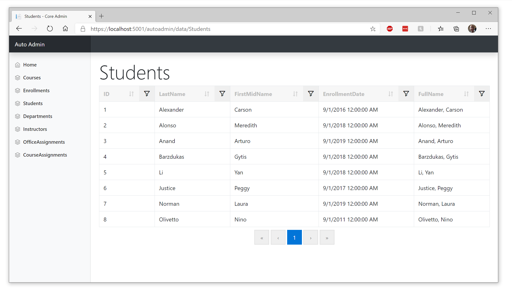
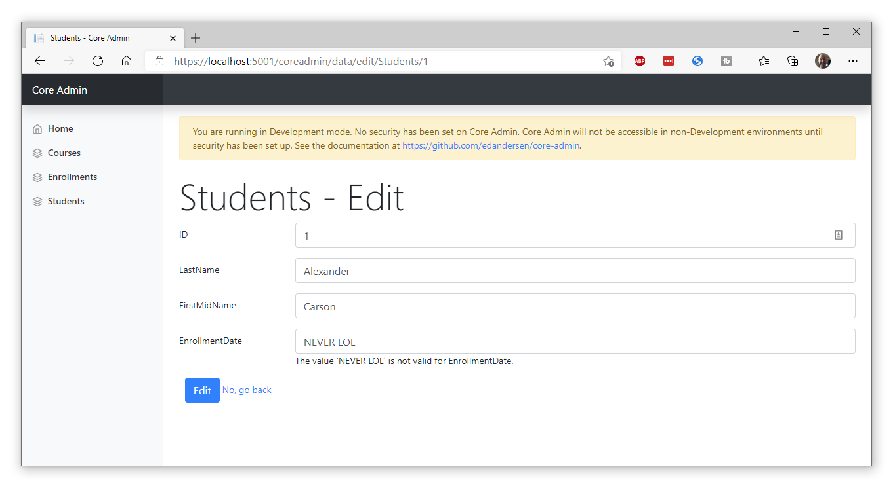
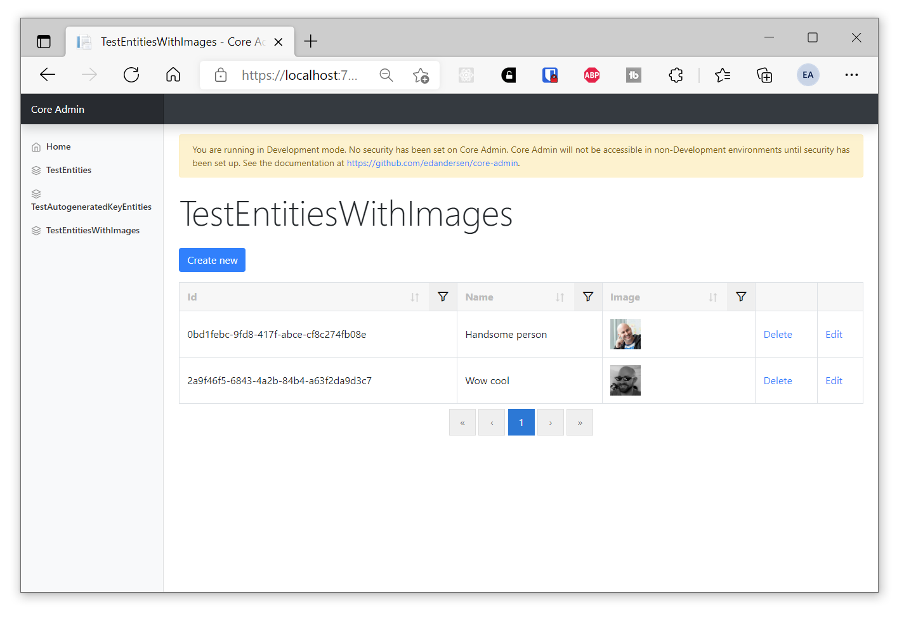
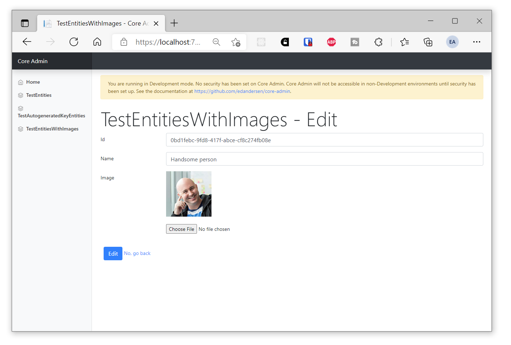
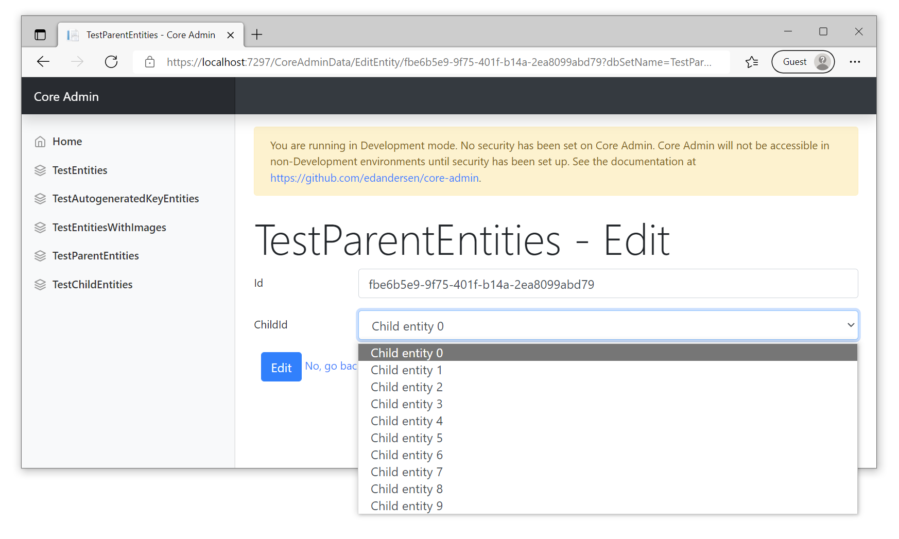
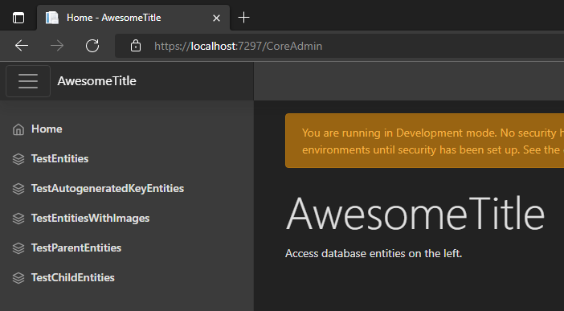
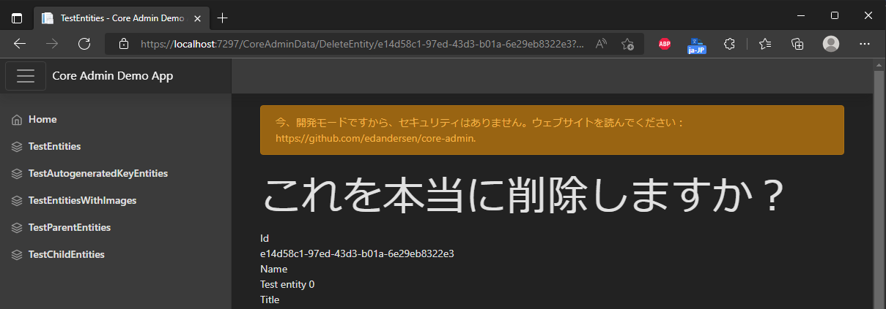

# Core Admin Panel for ASP.NET Core & .NET 8

[](https://github.com/edandersen/core-admin/actions/workflows/dotnet-core.yml)

> [🤩 Click here to view a live demo on a really slow free Azure Web App instance that might go down at any time!](https://core-admin-demo-2.azurewebsites.net/)

Fully automatic admin site generator for ASP.NET Core. Add one line of code, get loads of stuff. Features include:

- A data grid for all your entities
- Search, filter, sort etc on the grid
- CRUD screens with validation
- Binary support for image uploads
- Foreign key navigation
- Markdown editor
- ...and an awesome dark theme!





The above screenshots are of the [Contoso University sample](https://github.com/dotnet/AspNetCore.Docs/tree/master/aspnetcore/data/ef-rp/intro/samples/cu30) with Core Admin added to it.

Core Admin scans your app for Entity Framework DB Contexts and makes a nice set of CRUD screens for them.

## Setting up with .NET 6 Minimal APIs (version 2.0.0+)

Add via nuget:

```csharp
dotnet add package CoreAdmin
```

Add this line before ```var app = builder.Build();``` and after your DbContexts have been added to Services in Program.cs:

```csharp
builder.Services.AddCoreAdmin();
```

You need to make sure Endpoints are enabled as they don't appear to be in the default templates.
Also [static files middleware](https://learn.microsoft.com/en-us/aspnet/core/fundamentals/static-files) has to be enabled.

For example, add the following before ```app.Run();```:

```csharp
app.UseStaticFiles();
app.MapDefaultControllerRoute();
```

## How to use with .NET Core 3.1 and .NET 5 (version <2.0.0)

Add via nuget:

```csharp
dotnet add package CoreAdmin
```

Add this line at the bottom of ConfigureServices() (and after your DbContexts have been added to Services) in Startup.cs:

```csharp
services.AddCoreAdmin();
```
## Running the app

Run your app with with /coreadmin on the end of the URL, for example https://localhost:5001/coreadmin and you'll get the app appearing as shown above.

### Security

Basic role based security is currently supported. Whilst this does not need to be set up when running the admin panel in Development mode (for testing), all other environments need this set up.

#### Role based security

When adding Core Admin, provide the list of Roles required to access the panel, for example:

```csharp
services.AddCoreAdmin("Administrator");
```

The admin panel will then use the built in User Principal system to validate the roles. Essentially, if a normal call to ```User.IsInRole("rolename")``` would return ```true```, then the user will be able to access the panel.

#### Custom auth methods

You can also provide a function that will be evaluated on every request to see if the user can access the panel.

For example, in Configure, use the following method (don't use the exact method below as all requests will be refused):

```csharp
app.UseCoreAdminCustomAuth((serviceProvider) => Task.FromResult(false));
```

You can change this to your own logic as needed. You can read from cookies or do whatever you need to do, loading services from the serviceProvider.

### Binary file uploads

If your entities have byte array Properties, for example the Image property in the following:

```csharp
 public class TestEntityWithImage
    {
        [Key]
        [DatabaseGenerated(DatabaseGeneratedOption.Identity)]
        public Guid Id { get; set; }

        [Required]
        public string Name { get; set; }

        public byte[]? Image { get; set; }
    }
```

The package will attempt to render the byte arrays as images on the list view:



And also provide upload functionality on the Create and Edit views:



If you don't want this behaviour for a byte array property, make sure to prevent it from rendering in the forms using ScaffoldColumn(false):

```csharp
[System.ComponentModel.DataAnnotations.ScaffoldColumn(false)]
public byte[]? NotAnImage { get; set; }
```

### Foreign keys

If you have a foreign key in an entity, the create and edit screens will show a drop down list. For example:

```csharp
public class TestParentEntity
{
    [Key]
    public Guid Id { get; set; }

    [Display(AutoGenerateField = false)] // prevent showing on the grid
    public Guid ChildId { get; set; }

    [ForeignKey("ChildId")]
    public TestChildEntity Child { get; set; }
}
```

and

```csharp
public class TestChildEntity
{
    [Key]
    public Guid Id { get; set; }

    public string Name { get; set; }

    public override string ToString()
    {
        return Name;
    }
}

```

Will result in:



Make sure to provide a ToString() method on your Entity as this is what will be used in the drop down menu and in the grid!

### Markdown Editor
If you want to make a `string` Property editable with the Markdown editor. You need to add the `[DataType("Markdown")]` type to it. For example: 
```cs
[DataType("Markdown")]
public string? Body { get; set; }
```

### Custom URL to the admin panel

To use a custom URL, add this line of code in the ConfigureServices part of Startup.cs

```
app.UseCoreAdminCustomUrl("customurltoadmin");
```

you can then access the panel at ```/customurltoadmin``` or whatever you need it to be.

### Custom app title

To have a custom title of the app, use the following code in Program.cs or Startup.cs:

```
app.UseCoreAdminCustomTitle("AwesomeTitle");
```

This will result in something like this:



### Localisation

Localisation is supported with built in JSON files thanks to inspiration from https://github.com/Amine-Smahi/LocaliJson. English, French and Japanese are supported at the moment, please submit a pull request if you would like to add a translation!



### Ignoring certain entity types

You can prevent certain types of entities being shown or available in the admin panel by setting the ```IgnoreEntityTypes``` value in the options during ```AddCoreAdmin()```, like so:

```
services.AddCoreAdmin(new CoreAdminOptions() { IgnoreEntityTypes = new List<Type>() { typeof(DatabaseEntityToIgnore) } });
```

The above will make it so that ```DatabaseEntityToIgnore``` is not shown.

### CDN Support for the built in static assets

To use a CDN or serve the built in CSS and JS from another URL, copy the ```/css``` and ```/js``` folders from ```src/DotNetEd.CoreAdmin/wwwroot/``` to the root of your CDN. Then in ```Configure``` in Startup.cs, call the following method:

```
 app.UseCoreAdminCdn("https://my-cdn-root.com");
```

The Core Admin Razor Class library will then serve the static assets from this URL root rather than from the built in versions.

#### Troubleshooting

If you see a 401 error when accessing /coreadmin it means you are running in a non-development environment and you have not set a role up. See "Role based security" above.

### Community

You can find in this section some links about community content (writing, code samples, etc...). Don't hesitate to make a PR to add your own.

* [Add an admin CRUD web page to your ASP.NET Core web app in 5 minutes using EF Core Power Tools and CoreAdmin](https://erikej.github.io/efcore/aspnet/2022/01/25/efcore-admin-crud.html) (Blog post from ErikEJ)
* [Sample project of a blog using ASP.net API with CoreAdmin (backend) and NextJS (frontend)](https://github.com/Brouilles/CoreAdmin_BlogSample) (Sample app with NextJS)

### License

LGPL licensed. Depends on the snazzy [NonFactors.Grid.Mvc6](https://github.com/NonFactors/AspNetCore.Grid) and Bootstrap, both of which are MIT licensed.

### Authors

Ed Andersen ([@edandersen](https://twitter.com/edandersen))
