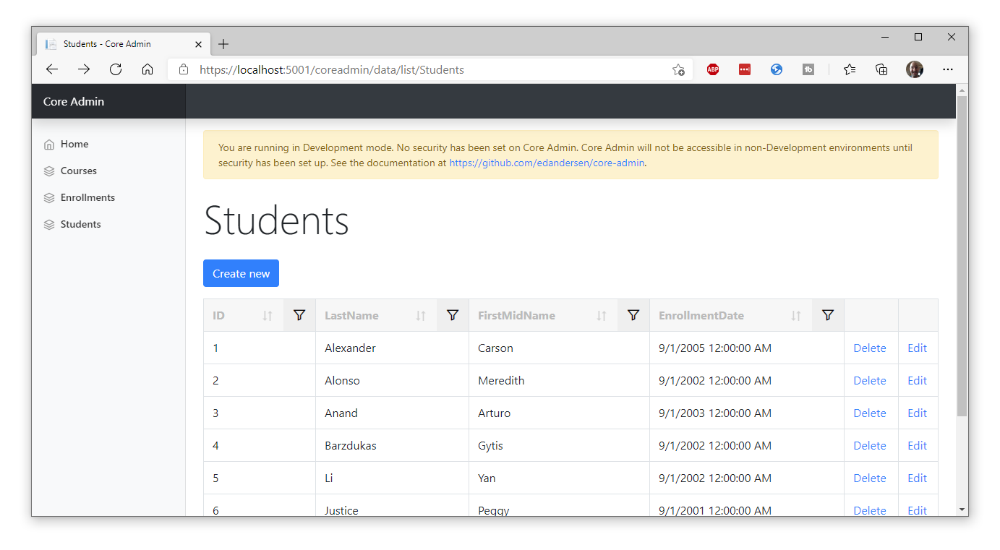

# Core Admin Panel for ASP.NET Core

[](https://github.com/edandersen/core-admin/actions/workflows/dotnet-core.yml)

Fully automatic admin site generator for ASP.NET Core. Add one line of code, get loads of stuff.

## How to use

Add via nuget:

```csharp
dotnet add package CoreAdmin
```

Add this line at the bottom of ConfigureServices() in Startup.cs:

```csharp
services.AddCoreAdmin();
```

Run your app with with /coreadmin on the end of the URL, for example https://localhost:5001/coreadmin and you'll get a little something like this -




The above screenshots are of the [Contoso University sample](https://github.com/dotnet/AspNetCore.Docs/tree/master/aspnetcore/data/ef-rp/intro/samples/cu30) with Core Admin added to it.

Core Admin scans your app for Entity Framework DB Contexts and makes a nice set of CRUD screens for them.

### Security

Basic role based security is currently supported. Whilst this does not need to be set up when running the admin panel in Development mode (for testing), all other environments need this set up.

#### Role based security

When adding Core Admin, provide the list of Roles required to access the panel, for example:

```csharp
services.AddCoreAdmin("Administrator");
```

The admin panel will then use the built in User Principal system to validate the roles. Essentially, if a normal call to ```User.IsInRole("rolename")``` would return ```true```, then the user will be able to access the panel.

#### Custom auth methods

You can also provide a function that will be evaluated on every request to see if the user can access the panel.

For example, if you update the AddCoreAdmin method (don't use the exact method below as all requests will be granted):

```csharp
services.AddCoreAdmin(() => Task.FromResult(true));
```

You can change this to your own logic as needed. You can read from cookies or do whatever you need to do.


#### Troubleshooting

If you see a 401 error when accessing /coreadmin it means you are running in a non-development environment and you have not set a role up. See "Role based security" above.

### License

LGPL licensed. Depends on the snazzy [NonFactors.Grid.Mvc6](https://github.com/NonFactors/AspNetCore.Grid) and Bootstrap, both of which are MIT licensed.

### Authors

Ed Andersen ([@edandersen](https://twitter.com/edandersen))
